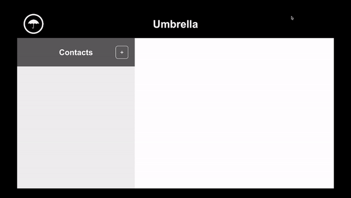

Project 1: Interactive Front-End Application

Project Name: Umbrella 

Project Application: Interactive Address Book

Project Members: Andrea Bell, Wendy Marcela Majia Ortiz, Alex Perry, Dan Smith, Sabrina Williams

## Project deployment: 
💡 See live version here: [https://marcelamejiao.github.io/Umbrella-Address-Book/](https://marcelamejiao.github.io/Umbrella-Address-Book/)

Github repository: https://github.com/marcelamejiao/Umbrella-Address-Book

## User Story:
AS A person wanting to socialise
I WANT an application to be able to look up my friends in an address book, see their address on a map, and what the weather is like where they are
SO THAT I can plan a visit to them (and know whether I need to take an umbrella or not)

## Project Requirements:

* Use a CSS framework like Bootstrap, Materialize, Bulma, etc.

* Be deployed to GitHub Pages.

* Be interactive (i.e., accept and respond to user input).

* Use at least two [server-side APIs](https://coding-boot-camp.github.io/full-stack/apis/api-resources).

* Does not use alerts, confirms, or prompts (use modals).

* Use client-side storage to store persistent data.

* Be responsive.

* Have a polished UI.

* Have a clean repository that meets quality coding standards (file structure, naming conventions, follows best practices for class/id naming conventions, indentation, quality comments, etc.).

* Have a quality README (with unique name, description, technologies used, screenshot, and link to deployed application).

## Acceptance Criteria

It's done when I am presented with a landing page where I can enter the address of my friend and save as a contact.

When I click on that contact, I am taken to a map displaying their location and the prevailing weather conditions of that location.

## Project Timeline
(insert image of timeline when completed 3 July)

## One page initial outline and summary of project including wireframe

## HTML and Javascript
(insert work milestones and key concepts of journey)

### Google Maps API:

The Google Maps API integration has two main components that are broken down into individual functions.
The 'renderMap' function and the 'addressToMap' function.
The main issue we experienced when working on the logic that would display the map of the contact's location and the details about the weather was that the renderMap function and the checkWeather function both took longitude and latitude values as variables to render the data. Because we do not expect users to enter their friend's longitude and latitude in their address book we needed a way to convert their address entries to the data type we needed (longitude and latitude). Luckily, we discovered within the Google Maps API there is a geocoding functionality. We used this to create the addressToMap function which parses through an address. Utilizing the Google Maps API, this address is searched for and the longitude and latitude values are a part of the data response. At the end of the function it then calls the checkWeather and renderMap functions using the longitude an latitude values as variables. This way the buttons can be programmed to call the addressToMap function, parsing through the relevant address and the app will render all the information needed.

### Weather API:
The WeatherAPI function calls the weatherAPI, which returns a JSON object with weather data. 
The checkWeather function requires two arguments; Latitude and Longitude which is called in the query.
From the returned data, we collect the current Temperature in celsius and the current weather icon URL.
A check is performed on the condition attribute if this text contains the word "rain" and then flags Rain as true or false. 

A series of conditional statements is run to assign an image based off temperature:
* below 16 degrees C, uses a snowflake image
* Between 16 degrees and 24 degrees a jacket image
* Between 24 degrees and 32 degrees a t-shirt image
* Greater than 32 degrees a flame image. 

A further conditional statement checks if 'Rain' is true, and will also append an Umbrella Icon. 

A string is created combining the above information, as Temperature, an icon for the general condition, the image representing the temperature conditional and then the umbrella Icon is displayed if required. 

On the index.html page, the element (div) with id 'weather' is then assigned the html from the created string  which will display the data collected above.

## UX/UI and CSS
* Styling of colour scheme
* Styling of buttons
* Merging headings and button copy to improve user experience
* Formatting of content for mobile and desktop - designed mobile first
* Screen shot before styling 

* Screen shot after styling 

Desktop:

Mobile:

